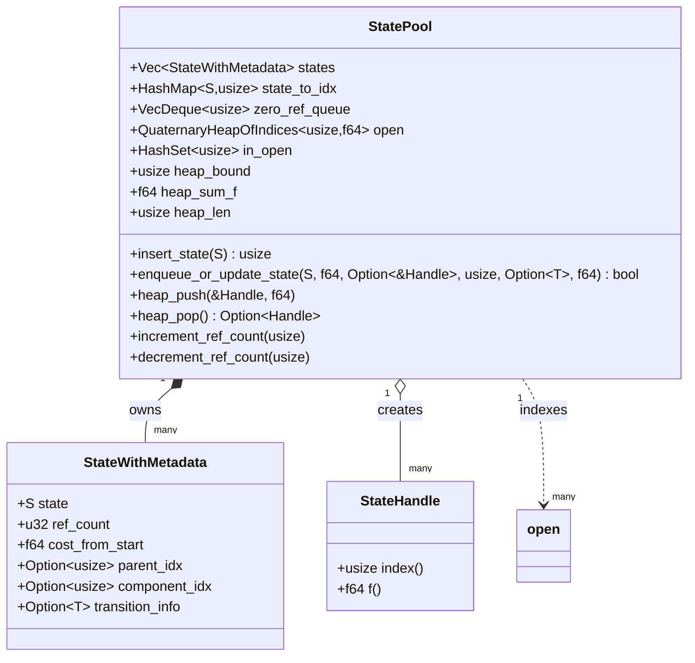

## State Pool

This module manages allocation, indexing, and lifecycle of search states alongside an indexed open set (priority queue). It ensures stable indices for states, reference-counted ownership, and deferred reclamation using a zero-refcount queue to preserve heuristic data until capacity pressure.

### Key Data Structures

- **StatePool<S, T>**: The central manager that owns all state storage and indices.
  - `states: Vec<StateWithMetadata<S, T>>`: Dense storage of states and metadata by stable index.
  - `state_to_idx: HashMap<S, usize>`: Map from state value to its stable index.
  - `zero_ref_queue: VecDeque<usize>`: FIFO queue of indices whose `ref_count == 0`, eligible for reuse. Entries remain initialized and mapped until actually reclaimed.
  - `open: QuaternaryHeapOfIndices<usize, f64>`: Heap keyed by index with priority `-f` (lower key is better). Indices must be `< heap_bound`.
  - `in_open: HashSet<usize>`: Tracks membership of indices in the heap for O(1) decrease-key checks.
  - `heap_bound: usize`: Current maximum supported index for the heap. Grows as needed.
  - `heap_sum_f: f64`, `heap_len: usize`: Accounting for average-f statistics.

- **StateWithMetadata<S, T>**: Per-index record with lifecycle information.
  - `state: S`: The state payload.
  - `ref_count: u32`: Number of owners (heap membership and live handles contribute).
  - `cost_from_start: f64`: Best-known g-cost for this state (used by heuristics and tie-breaking).
  - `parent_idx: Option<NonMaxUsize>`: Parent index in the reconstructed path, if any.
  - `component_idx: Option<NonMaxUsize>`: Connected-component or domain-specific grouping.
  - `transition_info: Option<T>`: Edge/action metadata leading to this state.

- **StateHandle<S, T>**: A lightweight, RAII-style handle that holds a reference on a state by index for the duration of its lifetime.

### High-Level Relationships (Class Diagram)



### Lifecycle of a State (Flow)

```mermaid
flowchart TD
    A[enqueue_or_update_state(state, g, parent, comp, trans, f)] -->|lookup| B{state_to_idx contains?}
    B -- no --> C[allocate_index]
    C --> D[states[idx] <- {state, g, metadata}]
    B -- yes --> E[maybe update cost_from_start]
    D --> F[heap readiness: ensure idx < heap_bound]
    E --> F
    F --> G{in_open?}
    G -- yes --> H[decrease_key(idx, f)]
    G -- no --> I[make_handle(idx) ; heap_push(idx, f)]
    I --> J[ref_count += 1 from heap]
    H --> K[search proceeds]
    J --> K

    subgraph Expansion & Ownership
      K --> L[heap_pop() -> Handle(idx)]
      L --> M[heap accounting update]
      M --> N[decrement_ref_count(idx) for heap membership]
      N --> O{ref_count == 0?}
      O -- no --> P[Active state retained]
      O -- yes --> Q[zero_ref_queue.push_back(idx)]
    end

    subgraph Reclamation
      R[Need new index] --> S{zero_ref_queue not empty?}
      S -- yes --> T[idx = pop_front()]
      T --> U[remove old mapping ; reset metadata]
      U --> V[reuse idx for new state]
      S -- no --> W[append new StateWithMetadata]
    end
```

### Deferred Freeing and Heuristic Integrity

- **Deferred freeing**: When `ref_count` drops to zero, the state is not immediately removed from `state_to_idx` and its metadata is not cleared. Instead, its index is enqueued in `zero_ref_queue`.
- **Heuristic consistency**: Because the state remains addressable by index and through `state_to_idx`, the best-known `cost_from_start` is still available to heuristics (e.g., best-g lookup) while memory pressure is low.
- **Actual reclamation**: Only when a new index is required and `zero_ref_queue` is non-empty do we reclaim an index. At that point we remove the old mapping and reset metadata, then reuse the slot for the new state.

### Heap Growth Policy

- The heap bound grows proactively via `grow_heap_if_needed` to ensure any index inserted into `open` is valid. Growth is triggered before push/decrease-key when `idx >= heap_bound`.
- Growth may trigger reindexing of `in_open` accounting but does not disturb state indices.

### Parent and Component Semantics

- Updating a state's parent decrements the previous parent's refcount (if present) and increments the new parent's refcount. This maintains ownership lifetimes of reconstruction paths.
- `component_idx` and `transition_info` are stored alongside the state to support downstream reconstruction and analysis.

### Invariants

- State indices are stable for the lifetime of a state; reuse only happens after it has refcount zero and is reclaimed from `zero_ref_queue`.
- `open` heap contains indices `< heap_bound`. The pool ensures bound growth before any operation that would violate this.
- `state_to_idx` remains consistent with `states` except during the brief reclamation step when the old key is removed prior to reuse.


